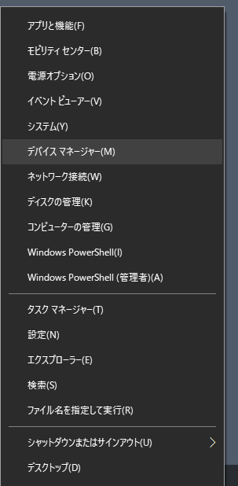
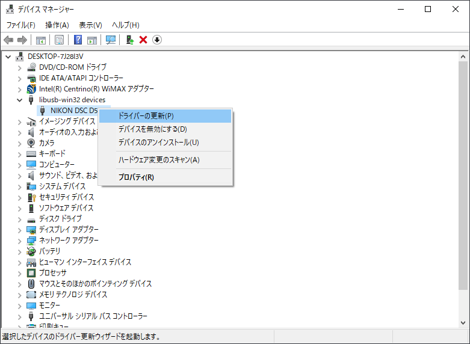
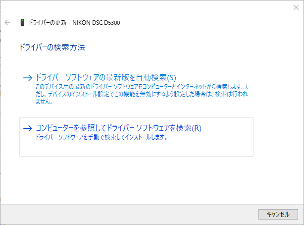
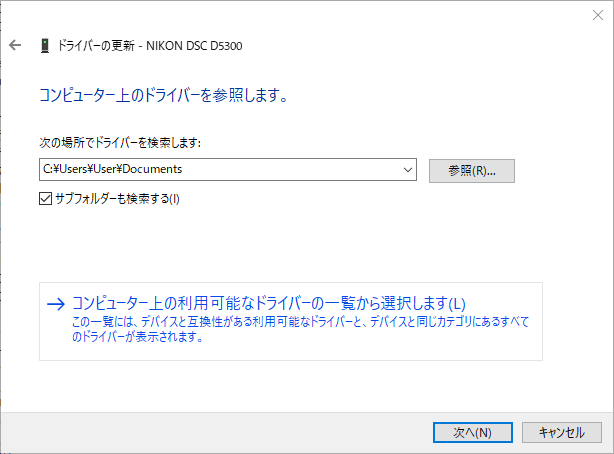
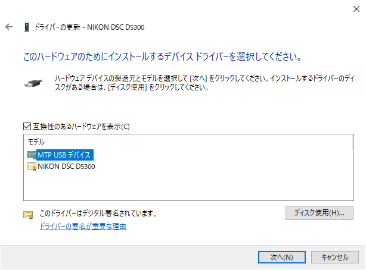
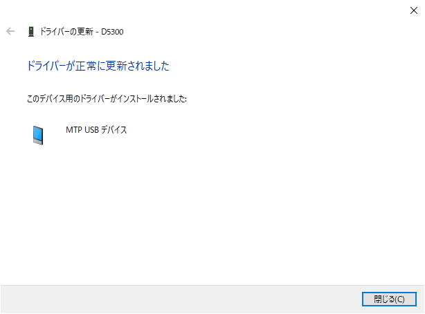

## イントロダクション


**English version is [here](./README.md)**

mtplvcapは、NikonのカメラのLive ViewをWebSocketでブラウザにリレーするマルチプラットフォーム対応 (Windows, Mac, Linux) のソフトです。

mtplvcapとOBSを組み合わせることで、NikonのカメラをHDMIキャプチャーボードなしでWebカメラにできます。お気に入りのカメラでGoogle Hangouts・Meet・Zoomを楽しみましょう！


## 動作を確認している環境

### サポートするカメラ（多分動くものを含む）

|機種 |LV 利用可    |ステータス        |[高解像度](#hr)   |確認した人              |
|:----|:-----------:|:----------------:|:----------------:|:-----------------------|
|D3   |Yes          |                  |?                 |動作確認をお待ちしています！|
|D3X  |Yes          |                  |?                 |動作確認をお待ちしています！|
|D3S  |Yes          |                  |?                 |動作確認をお待ちしています！|
|D4   |Yes          |                  |?                 |動作確認をお待ちしています！|
|D4S  |Yes          |                  |?                 |動作確認をお待ちしています！|
|D5   |Yes          |                  |?                 |動作確認をお待ちしています！|
|D6   |Yes          |:white_check_mark:|:thinking:        |@puhitaku|
|D90  |Yes          |:white_check_mark:|?                 |[@sachaos](https://github.com/sachaos)|
|D300 |Yes          |[#31](https://github.com/puhitaku/mtplvcap/issues/31)|?|追加の動作確認をお待ちしています！|
|D300S|Yes          |                  |?                 |動作確認をお待ちしています！|
|D500 |Yes          |:white_check_mark:|:white_check_mark:|[@yasuoeto](https://github.com/yasuoeto)|
|D600 |Yes          |:white_check_mark:|?                 |[@ohtayo](https://github.com/ohtayo)|
|D610 |Yes          |:white_check_mark:|?                 |@hazlitt|
|D700 |?            |[#11](https://github.com/puhitaku/mtplvcap/issues/11)|?|追加の動作確認をお待ちしています！|
|D750 |Yes          |:white_check_mark:|?                 ||
|D780 |Yes          |:white_check_mark:|:thinking:        |@puhitaku|
|D800 |Yes          |:white_check_mark:|?                 |[@pcjpnet](https://twitter.com/pcjpnet)|
|D800E|Yes          |:white_check_mark:|?                 |[@Higomon](https://github.com/Higomon)|
|D810 |Yes          |                  |?                 |動作確認をお待ちしています！|
|D850 |Yes          |:white_check_mark:|:white_check_mark:|@puhitaku|
|D3200|Yes          |:white_check_mark:|?                 |@Ivisi|
|D3300|Yes          |:white_check_mark:|?                 |[@unasuke](https://github.com/unasuke)|
|D3400|Yes          |:white_check_mark:|?                 |@chefaustin|
|D3500|Yes          |:white_check_mark:|?                 |[@fedegratti](https://github.com/fedegratti)|
|D5000|Yes          |:white_check_mark:|?                 |[@rch850](https://github.com/rch850)|
|D5100|Yes          |:white_check_mark:|?                 |[@shigureanko](https://twitter.com/shigureanko)|
|D5200|Yes          |:white_check_mark:|?                 |[@ThatSameer](https://twitter.com/ThatSameer)|
|D5300|Yes          |:white_check_mark:|                  |@puhitaku|
|D5500|Yes          |:white_check_mark:|?                 |[@nasustim](https://github.com/nasustim)|
|D5600|Yes          |:white_check_mark:|?                 |[@tadasv](https://github.com/tadasv)|
|D7000|Yes          |:white_check_mark:|?                 |@takashi0314|
|D7100|Yes          |:white_check_mark:|?                 |@TheMidlander|
|D7200|Yes          |:white_check_mark:|?                 |[@br_spike_love](https://twitter.com/br_spike_love)|
|D7500|Yes          |:white_check_mark:|:white_check_mark:|@puhitaku|
|Df   |Yes          |:white_check_mark:|?                 ||
|Z5   |Yes          |:white_check_mark:|:thinking:        |[@ag-eitilt](https://github.com/ag-eitilt)|
|Z6   |Yes          |:white_check_mark:|:white_check_mark:|@ShadowXii|
|Z6II |Yes          |:white_check_mark:|:thinking:        |@puhitaku|
|Z7   |Yes          |:white_check_mark:|:thinking:        |@zacheadams|
|Z7II |Yes          |:white_check_mark:|:thinking:        |@puhitaku|
|Z9   |Yes          |                  |?                 |未発売だが多分動く :wink:|
|Z50  |Yes          |:white_check_mark:|:thinking:        |@puhitaku|
|Z fc |Yes          |:white_check_mark:|:thinking:        |@puhitaku|


<h4 id="hr">「高解像度」とは？</h4>

通常のフレーム解像度はいずれの機種も 640x424 ですが、比較的新しい機種は 1024xXXX のような高い解像度をサポートしている場合があります。いくつかのモデルは既に解像度の変更ができていますが、サポートしていながら解像度の変更に失敗する機種もあります。[この問題](https://github.com/puhitaku/mtplvcap/issues/44)は、今後解決方法が判明次第実装し解決する予定です。

|マーク            |説明|
|:----------------:|:---|
|`?`               |未確認|
|空白              |高解像度をサポートしない|
|:thinking:        |高解像度をサポートしているが設定に失敗する|
|:white_check_mark:|高解像度をサポートしていて設定も成功する|


### サポートしないカメラ

注釈: リンクが張られていない機種は動作未確認だが多分そもそも LV 機能を持たない

 - 1ケタ機種の一部 D1, D1X, D1H, D2H, D2X, D2Hs, D2Xs
 - 2ケタ機種の一部 D40, D40x, D50, D60, D70, D70s, D80
 - 3ケタ機種の一部 D100, D200
 - 4ケタ機種の一部 [D3000](https://github.com/puhitaku/mtplvcap/issues/18), D3100
 - Nikon 1 シリーズ
   - [1 J5](https://github.com/puhitaku/mtplvcap/issues/4) は LV を開始しようとすると「未サポート」と応答が返ってくる
   - 知られていない MTP の命令を使うとおそらく LV を有効化できる
   - Nikon 1 シリーズの LV やテザー撮影についてなにか情報をお持ちの方はぜひ教えて下さい
 - COOLPIX シリーズ


### 確認済みのOSとその他のソフト

|OS|OBS|仮想カメラ|ブラウザ|
|:-|:-|:-|:-|
|Windows 10 version 1909, Build 18363.900, amd64|25.0.8|OBS Virtualcam 2.0.5|Microsoft Edge 84.0.522.44 (Chromium Edge)|
|macOS 10.15.5 Catalina, amd64|25.0.8|obs-mac-virtualcam 3ca8f62 v1.2.0|Google Chrome 84.0.4147.89, Microsoft Edge 84.0.522.44|
|macOS 11.2.3 Big Sur, arm64|26.1.2||Microsoft Edge 88.0.705.68|
|Debian 10 Buster, amd64|25.0.7-442-ge3942061|obs-v4l2sink 1ec3c8a|Mozilla Firefox 68.10.0esr|
|Debian sid (2021-03-27), amd64|26.1.2-290-ga52012e8c|||

※ ブラウザはビデオ通話の動作テストを行ったもので、載っているブラウザでないと動作しないわけではありません


## インストール方法

注釈: このセクションにあるShellのコードスニペットは全部コピペできます。


### Windows

**重要！ Windowsでは、カメラを接続して自動でインストールされるドライバをWinUSBの汎用ドライバで置き換える必要があります。
置き換えると、手動でドライバを指定し直さない限りカメラはMTPデバイスとして認識されなくなります（カメラ自体に何かを書き込んだりはしません）
元に戻すのは至って簡単です; [こちら](#必要な場合ドライバをOS標準に戻す)のガイドを参照してください。**


#### 1. 一眼レフのドライバを置き換える

1. カメラをPCに接続します
1. Zadigを[ここ](https://zadig.akeo.ie/)からダウンロードして開きます
1. `List All Devices` にチェックを入れます

    

1. 画面上のリストにカメラ名があるのを確認し、選択します

    

    （このスクショは置き換え後に撮ったものなので、ボタンの表記が "Reinstall Driver" となっていますが気にしないでください）

1. 中央下の選択ボックスで `WinUSB (vX.X.X.X)` を選択します
    - 他の選択肢は動作しないので注意してください

1. `Replace Driver` ボタンを押して完了するまで待ちます
    - デバイスマネージャーを起動して確認してみてください

    


#### 2a. ビルド済みの実行ファイルを使う

1. Windows用の実行ファイル (mtplvcap_windows_amd64.zip) を[ここ](https://github.com/puhitaku/mtplvcap/releases)からダウンロードします
1. ZIPをダブルクリックして展開します
1. `mtplvcap.exe` をダブルクリックして実行します
    - カメラのシャッターが開くのを確認してください


#### 2b. MSYS2で手でビルドする

1. MSYS2を[ここ](https://www.msys2.org/)からダウンロードしてインストールします
1. スタートメニューから "MSYS2 MSYS" を実行します
1. 依存するパッケージをインストールします

    - パッケージグループ `mingw-w64-x86_64-toolchain` とその他のパッケージを一度にインストールしようとするとエラーになる報告が上がっていて、これらは別々にインストールしたほうが良いかもしれません

	```sh
    pacman -Sy
    pacman -S mingw-w64-x86_64-toolchain
    pacman -S \
        mingw-w64-x86_64-libusb \
        mingw-w64-x86_64-go \
        mingw-w64-x86_64-pkg-config \
        git
    ```

1. PATHを追加します

    ```sh
    echo 'PATH=$PATH:/mingw64/bin:/mingw64/lib/go/bin' >> ~/.bashrc
    source ~/.bashrc
    ```

1. このリポジトリをクローンします

    ```sh
    git clone https://github.com/puhitaku/mtplvcap.git
    ```

1. `cd`してビルドして起動します

    ```sh
    cd mtplvcap
    CGO_CFLAGS='-Wno-deprecated-declarations' go build .
    ./mtplvcap.exe -debug server
    ```

    - カメラのシャッターが開くのを確認してください
    - `GOROOT=/mingw64/lib/go go build .` のようにGOROOTの指定が要るかもしれません

1. ゴール！
    - ビルドされたバイナリは移動したり再配布したりすることが可能です
    - `C:\msys64\mingw64\bin\libusb-1.0.dll` から `libusb-1.0.dll` を `mtplvcap.exe` と同じディレクトリにコピーしてくればどこでも起動できます

#### （必要な場合）ドライバをOS標準に戻す

ドライバをWinUSBに置き換えた場合、mtplvcapで使用できる代わりに、
一般的なMTPで通信するアプリ（例: 写真を取り込むアプリなど）が使用できなくなります。
以下の手順で元に戻すことができます。

1. スタートボタンを右クリックし、「デバイス マネージャー」をクリックします

    

1. "ユニバーサル シリアル バス デバイス" 以下にあるカメラを右クリックし、「ドライバーの更新」をクリックします

    

1. 「コンピューターを参照してドライバーソフトウェアを検索」をクリックします

    

1. 「コンピューター上の利用可能なドライバーの一覧から選択します」をクリックします

    

1. 一覧から「MTP USB デバイス」を選択し「次へ」をクリックします

    

1. 「ドライバーが正常に更新されました」と表示されたら完了です

    


### macOS

#### 1. 依存パッケージをインストールする
1. [Homebrew](https://brew.sh/)をインストールします

1. libusbをインストールします

    ```sh
    brew install libusb
    ```


#### 2a. ビルド済みの実行ファイルを使う

1. macOS用の実行ファイル (mtplvcap_macos_amd64.zip) を[ここ](https://github.com/puhitaku/mtplvcap/releases)からダウンロードします
1. ZIPを展開して起動します

    ```sh
    unzip mtplvcap_macos_amd64.zip
    ./macos/mtplvcap
    ```

    - 初回はセキュリティのアラートが出て実行できないはずです

1. 検証されていないバイナリの実行を許可する

    - 「キャンセル」でダイアログを消します (ゴミ箱には入れないでください！)

    

    - 「システム環境設定」 -> 「セキュリティとプライバシー」 と開き、「このまま許可」 をクリック

    

    - `mtplvcap` ももう一度起動し「開く」をクリック

    

    - カメラのシャッターが開くのを確認してください


#### 2b. 手でビルドする

1. 依存パッケージをインストールします

    ```sh
    brew install golang git
    ```

1. XCode Command Line Toolsをインストールします

    ```sh
    xcode-select --install
    ```

1. このリポジトリをクローンします

    ```sh
    git clone https://github.com/puhitaku/mtplvcap.git
    ```

1. `cd`してビルドして起動します

    ```sh
    cd mtplvcap
    CGO_CFLAGS='-Wno-deprecated-declarations' go build .
    ./mtplvcap -debug server
    ```

    - カメラのシャッターが開くのを確認してください

1. ゴール！


### Linux

ビルド済みバイナリはありますが、Linuxはディストリによって環境が大きく異なるため、手でビルドすることをおすすめします。


#### 1. 依存パッケージをインストールする

1. libusbをインストールします

    ```sh
    # For Debian/Ubuntu:
    sudo apt install libusb-1.0.0
    ```

    ```sh
    # For Arch:
    pacman --sync libusb
    ```


#### 2a. ビルド済みの実行ファイルを使う

1. Linux用の実行ファイル (mtplvcap_linux_amd64.zip) を[ここ](https://github.com/puhitaku/mtplvcap/releases)からダウンロードします

1. ZIPを展開して起動します

    ```sh
    unzip mtplvcap_linux_amd64.zip
    ./linux/mtplvcap
    ```

    - カメラのシャッターが開くのを確認してください


#### 2b. 手でビルドする

1. 依存パッケージをインストールします

    ```sh
    # For Debian/Ubuntu:
    sudo apt install golang-go libusb-1.0.0-dev
    ```

    ```sh
    # For Arch:
    pacman --sync go libusb
    ```

1. `cd`してビルドして起動します

    ```sh
    cd mtplvcap
    CGO_CFLAGS='-Wno-deprecated-declarations' go build .
    ./mtplvcap -debug server
    ```

    - カメラのシャッターが開くのを確認してください


### 使い方

```sh
$ ./mtplvcap -help
Usage of ./mtplvcap:
  -backend-go
        force gousb as libusb wrapper (not recommended)
  -debug string
        comma-separated list of debugging options: usb, data, mtp, server
  -host string
        hostname: default = localhost, specify 0.0.0.0 for public access (default "localhost")
  -max-resolution
        change the resolution to the max (experimental)
  -port int
        port: default = 42839 (default 42839)
  -product-id string
        PID of the camera to search (in hex), default=0x0 (all) (default "0x0")
  -server-only
        serve frontend without opening a DSLR (for devevelopment)
  -vendor-id string
        VID of the camera to search (in hex), default=0x0 (all) (default "0x0")
```


#### 撮られている映像を見る

 - `http://localhost:42839/view` を開くとキャプチャされたフレームが見えます


#### ブラウザでカメラを制御する

 - `http://localhost:42839` を開くとカメラを制御するコントローラーが使えます
 - "Auto Focus" セクションは一定間隔もしくは手動でAFを動作させられます
 - "Rate Limit" セクションはフレームレートの上限を設定でき、CPU消費量の削減に使えます
 - "Information" セクションはキャプチャされているフレームの大きさ、FPS、プレビューが見えます


#### Zoom, Google Meet, Google Hangoutsなどとつなぐ

1. mtplvcapをインストールし、動作することを確認します

1. OBS (Open Broadcaster Software) を[ここ](https://obsproject.com/)からインストールします

1. OBSバーチャルカメラをインストールします（OSにより異なります; ググってください）

1. OBSの設定を開き「映像」タブを開きます

1. Live Viewの画像サイズとぴったり合うように映像サイズを設定します
    - mtplvcapを起動して `localhost:42839` を開くと「Information」セクションにサイズが載っています

    
    

1. 「ブラウザ」ソースを追加します

    

1. 「幅」と「高さ」の値を「映像」タブの設定と同じ値に設定します

1. URLを `http://localhost:42839/view` に設定します

    

1. バーチャルカメラをONにしてチャットアプリを設定します

1. キター！！！

    
    


### 諸注意

 - このソフトはアルファ版です


### 既知の問題

 - 勝手にLVが止まる
    - この自動オフは「パワーオフ時間」の設定で延長できますが、ものによって最大30分だったり、無制限だったりします
        - D5300の場合: "カスタムメニュー" -> "c AEロック・タイマー" -> "c2 パワーオフ時間" -> "カスタマイズ" -> "ライブビュー表示" -> "30分"
    - 現状では、LVが止まっていたら自動で開始するというワークアラウンドで対処しています
 - D5000: コントローラー画面で画像サイズが異常
    - 正確には640x426
 - Windowsのみ: MinTTY（MSYS2付属のターミナルエミュレータ）でmtplvcapを動かしている時、Ctrl-Cで終了すると終了処理が行われずに突然Killされる
    - 終了処理が行われないので、次の起動時に初期化に失敗したり、ケーブルの抜き差しが必要になったりします
    - これはMinTTYおよびでは知られた動作であり、mtplvcapのバグではありません
    - winptyをpacmanでインストールして、それ経由で起動すると解決します: `pacman -Sy winpty && winpty ./mtplvcap`
    - Explorerから直接mtplvcapを起動するのは問題ありません、ただしバツボタンではなく必ずCtrl-Cで終了してください


### フィードバック

 - IssueもPRも大歓迎です。[CONTRIBUTING.md](./CONTRIBUTING.md)に従って提出してください。
 - まだごく一部の機種しか動作確認できていません。是非お手持ちのカメラが動作したかどうか教えてください。何卒！


### Special Thanks

このプログラムは[github.com/hanwen/go-mtpfs](https://github.com/hanwen/go-mtpfs)からForkして大改造したものです。
go-mtpfsの成熟したMTP実装のおかげで実装のスタートを切れました。Han-Wenさん本当にありがとうございます。

[github.com/dukus/digiCamControl](https://github.com/dukus/digiCamControl)もMTPのペイロードをパースするために大いに参考にしました。
もしこのコードがなかったらmtplvcapは実装できていなかったと思います。

### ライセンス

[LICENSEファイルはこちら](./LICENSE)
