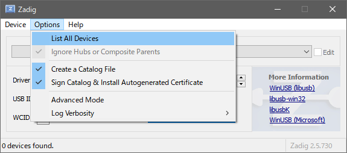
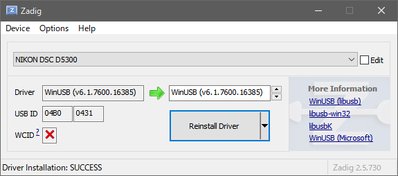
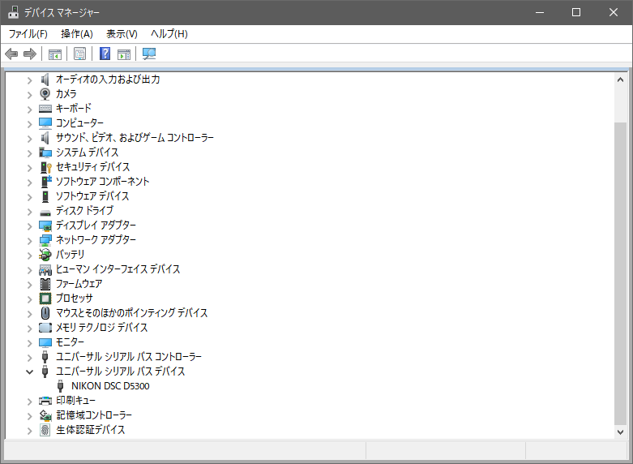

## Introduction


**日本語は[こちら](./README.ja.md)**

mtplvcap is a multi-platform (Windows/Mac/Linux) software that relays the Live View of Nikon cameras via WebSocket. 

mtplvcap + OBS turn your cameras into web cameras without HDMI capture device. Enjoy video chatting on Google Hangouts/Meet/Zoom etc. with your favorite cameras!


## Environments

### Supported models (incl. potentially supported)

|Model|Has Live View|Status            |[High Res](#hr)   |Confirmed By|
|:----|:-----------:|:----------------:|:----------------:|:-----------|
|D3   |Yes          |                  |?                 |Please give me a report!|
|D3X  |Yes          |                  |?                 |Please give me a report!|
|D3S  |Yes          |                  |?                 |Please give me a report!|
|D4   |Yes          |                  |?                 |Please give me a report!|
|D4S  |Yes          |                  |?                 |Please give me a report!|
|D5   |Yes          |                  |?                 |Please give me a report!|
|D6   |Yes          |:white_check_mark:|:thinking:        |@puhitaku|
|D90  |Yes          |:white_check_mark:|?                 |[@sachaos](https://github.com/sachaos)|
|D300 |Yes          |[#31](https://github.com/puhitaku/mtplvcap/issues/31)|?|I welcome additional reports!|
|D300S|Yes          |                  |?                 |Please give me a report!|
|D500 |Yes          |:white_check_mark:|:white_check_mark:|[@yasuoeto](https://github.com/yasuoeto)|
|D600 |Yes          |:white_check_mark:|?                 |[@ohtayo](https://github.com/ohtayo)|
|D610 |Yes          |:white_check_mark:|?                 |@hazlitt|
|D700 |?            |[#11](https://github.com/puhitaku/mtplvcap/issues/11)|?|I welcome additional reports!|
|D750 |Yes          |:white_check_mark:|?                 ||
|D780 |Yes          |:white_check_mark:|:thinking:        |@puhitaku|
|D800 |Yes          |:white_check_mark:|?                 |[@pcjpnet](https://twitter.com/pcjpnet)|
|D800E|Yes          |:white_check_mark:|?                 |[@Higomon](https://github.com/Higomon)|
|D810 |Yes          |                  |?                 |Please give me a report!|
|D850 |Yes          |:white_check_mark:|:white_check_mark:|@puhitaku|
|D3200|Yes          |:white_check_mark:|                  |@Ivisi|
|D3300|Yes          |:white_check_mark:|                  |[@unasuke](https://github.com/unasuke)|
|D3400|Yes          |:white_check_mark:|?                 |@chefaustin|
|D3500|Yes          |:white_check_mark:|?                 |[@fedegratti](https://github.com/fedegratti)|
|D5000|Yes          |:white_check_mark:|                  |[@rch850](https://github.com/rch850)|
|D5100|Yes          |:white_check_mark:|                  |[@shigureanko](https://twitter.com/shigureanko)|
|D5200|Yes          |:white_check_mark:|                  |[@ThatSameer](https://twitter.com/ThatSameer)|
|D5300|Yes          |:white_check_mark:|                  |@puhitaku|
|D5500|Yes          |:white_check_mark:|?                 |[@nasustim](https://github.com/nasustim)|
|D5600|Yes          |:white_check_mark:|?                 |[@tadasv](https://github.com/tadasv)|
|D7000|Yes          |:white_check_mark:|?                 |@takashi0314|
|D7100|Yes          |:white_check_mark:|?                 |@TheMidlander|
|D7200|Yes          |:white_check_mark:|?                 |[@br_spike_love](https://twitter.com/br_spike_love)|
|D7500|Yes          |:white_check_mark:|:white_check_mark:|@puhitaku|
|Df   |Yes          |:white_check_mark:|?                 ||
|Z5   |Yes          |:white_check_mark:|:thinking:        |[@ag-eitilt](https://github.com/ag-eitilt)|
|Z6   |Yes          |:white_check_mark:|:white_check_mark:|@ShadowXii|
|Z6II |Yes          |:white_check_mark:|:white_check_mark:|@puhitaku|
|Z7   |Yes          |:white_check_mark:|:thinking:        |@zacheadams|
|Z7II |Yes          |:white_check_mark:|:white_check_mark:|@puhitaku|
|Z9   |Yes          |:white_check_mark:|:white_check_mark:|@oxpa|
|Z50  |Yes          |:white_check_mark:|:thinking:        |@puhitaku|
|Z fc |Yes          |:white_check_mark:|:white_check_mark:|@puhitaku|


<h4 id="hr">What is "High Res"?</h4>

While the default resolution is 640x424 for all models, newer models support capturing high res image like 1024xXXX. Changing the resolutions for some models succeeds but some do not. This problem is tracked in [an issue](https://github.com/puhitaku/mtplvcap/issues/56) and may be resolved when the right method to change the resolution is found.

|Icon              |Meaning|
|:----------------:|:------|
|`?`               |Untested|
|Blank             |It has no higher resolutions|
|:thinking:        |It replies higher resolutions but not confirmed to work (confirmation report is much appreciated)|
|:white_check_mark:|It replies higher resolutions and setting the resolution succeeds|


### Unsupported models

Note: model names without a link is not confirmed but may not support live viewing

 - One digit D series D1, D1X, D1H, D2H, D2X, D2Hs, D2Xs
 - Two digits D series D40, D40x, D50, D60, D70, D70s, D80
 - Three digits D series D100, D200
 - Four digits D series [D3000](https://github.com/puhitaku/mtplvcap/issues/18), D3100
 - Nikon 1 series
   - [1 J5](https://github.com/puhitaku/mtplvcap/issues/4) responds "unsupported" as a reply of Start Live View request, so mysterious
   - There may be an unknown MTP operation to get it working
   - Please tell me anything you know about Live View or tethered shoot of Nikon 1 series!
 - COOLPIX series


### Verified OSes and other software

|OS|OBS|Virtual camera|Browser|
|:-|:-|:-|:-|
|Windows 10 version 1909, Build 18363.900, amd64|25.0.8|OBS Virtualcam 2.0.5|Microsoft Edge 84.0.522.44 (Chromium Edge)|
|macOS 10.15.5 Catalina, amd64|25.0.8|obs-mac-virtualcam 3ca8f62 v1.2.0|Google Chrome 84.0.4147.89, Microsoft Edge 84.0.522.44|
|macOS 11.2.3 Big Sur, arm64|26.1.2||Microsoft Edge 88.0.705.68|
|Debian 10 Buster, amd64|25.0.7-442-ge3942061|obs-v4l2sink 1ec3c8a|Mozilla Firefox 68.10.0esr|
|Debian sid (2021-03-27), amd64|26.1.2-290-ga52012e8c|||

Note: Browsers listed here are used to check if virtual cams work well. Any other browsers should work.


## How to install

Notice: Snippets described here should run as-is and copy-and-pastable.


### Windows

**Important: For Windows, you have to replace a pre-installed MTP driver with WinUSB driver.
Your PC will no longer recognize the camera as an MTP device unless you re-install it manually.
Reverting back is super easy! Follow [the instruction](#revert-back-the-driver-if-necessary) to revert back the driver.**


#### 1. Replace MTP driver

1. Connect your Nikon camera to the PC
1. Download Zadig from [here](https://zadig.akeo.ie/) and launch it
1. Tick `List All Devices`

    

1. Make sure that your camera is in the list upper in the window and choose it

    

    (This screenshot was taken after the WinUSB driver is installed and will differ from what you see)

1. Choose `WinUSB (vX.X.X.X)` in the input box in the middle of the window
    - Please keep in mind that other choices do NOT work

1. Click `Replace Driver` button and wait it finishes the installation
    - Optionally, open the Device Manager and make sure it's installed

    


#### 2a. Use a pre-built executable

1. Download the release from [here](https://github.com/puhitaku/mtplvcap/releases) (mtplvcap_windows_amd64.zip).
1. Extract the ZIP
1. Double-click `mtplvcap.exe`
    - Make sure your camera opens up its shutter


#### 2b. Build it yourself in MSYS2

1. Download and install MSYS2 from [here](https://www.msys2.org/)
1. Launch "MSYS2 MSYS" in the Start Menu
1. Install dependencies

    - Some people reported that pacman fails to install a package group `mingw-w64-x86_64-toolchain` and other packages at once. Installing them separately should succeed.

    ```sh
    pacman -Sy
    pacman -S mingw-w64-x86_64-toolchain
    pacman -S \
        mingw-w64-x86_64-libusb \
        mingw-w64-x86_64-go \
        mingw-w64-x86_64-pkg-config \
        git
    ```

1. Add PATHs

    ```sh
    echo 'PATH=$PATH:/mingw64/bin:/mingw64/lib/go/bin' >> ~/.bashrc
    source ~/.bashrc
    ```

1. Clone this repo

    ```sh
    git clone https://github.com/puhitaku/mtplvcap.git
    ```

1. `cd`, build, and launch it

    ```sh
    cd mtplvcap
    CGO_CFLAGS='-Wno-deprecated-declarations' go build .
    ./mtplvcap.exe -debug server
    ```
   
    - Make sure your camera opens up its shutter
    - Perhaps you have to specify GOROOT like `GOROOT=/mingw64/lib/go go build .`

1. Done!
    - The binary can be moved and redistributed easily
    - Copy `libusb-1.0.dll` from `C:\msys64\mingw64\bin\libusb-1.0.dll` and place the copy alongside `mtplvcap.exe` to launch it directly from Explorer


#### Revert back the driver (if necessary)

Generic MTP apps will no longer be able to communicate with cameras with replaced WinUSB driver.
To revert it back, follow the instruction:

(Screenshots are not available as I don't have English Windows. Sorry for inconvenience.)

1. Right-click the Start Button and click "Device Manager"

1. Right-click your camera in the "Universal Serial Bus devices" section and click "Update driver"

1. Click "Browse my computer for driver software"

1. Click "Let me pick from a list of device drivers on my computer"

1. Choose "MTP USB Device" in the list and click "Next >"

1. It'll show "Windows has successfully updated your driver software" and it's done


### macOS

#### 1. Install dependencies

1. [Install Homebrew](https://brew.sh/) 

1. Install libusb

    ```sh
    brew install libusb
    ```


#### 2a. Use a pre-built executable

1. Download the release from [here](https://github.com/puhitaku/mtplvcap/releases) (mtplvcap_macos_amd64.zip).
1. Extract the ZIP and launch it

    ```sh
    unzip mtplvcap_macos_amd64.zip
    ./macos/mtplvcap
    ```
    - macOS will warn you that the binary is not verified

1. Allow non-verified binary to launch

    - Dismiss the dialog (Do not move it to the trash!)

    

    - Open "System Preferences" -> "Security & Privacy" -> Click "Allow Anyway"

    

    - Launch `mtplvcap` once more and click "Open"

    

    - Make sure your camera opens up its shutter


#### 2b. Build it yourself

1. Install dependencies

    ```sh
    brew install golang git
    ```

1. Install XCode Command Line Tools with `xcode-select --install`

1. Clone this repo

    ```sh
    git clone https://github.com/puhitaku/mtplvcap.git
    ```

1. `cd`, build, and launch it

    ```sh
    cd mtplvcap
    CGO_CFLAGS='-Wno-deprecated-declarations' go build .
    ./mtplvcap -debug server
    ```

    - If macOS blocks the downloaded executable and show alerts, please follow [this procedure](https://github.com/hashicorp/terraform/issues/23033#issuecomment-542302933) to proceed
    - Make sure your camera opens up its shutter

1. Done!


### Linux

I strongly recommend you to compile by yourself for Linux distributions as Linux environments vary widely.


#### 1. Install dependencies

1. Install libusb

    ```sh
    # For Debian/Ubuntu:
    sudo apt install libusb-1.0-0
    ```

    ```sh
    # For Arch:
    pacman --sync libusb
    ```


#### 2a. Use a pre-built executable

1. Download the release from [here](https://github.com/puhitaku/mtplvcap/releases) (mtplvcap_linux_amd64.zip).

1. Extract the ZIP and launch it

    ```sh
    unzip mtplvcap_linux_amd64.zip
    ./linux/mtplvcap
    ```

    - Make sure your camera opens up its shutter


#### 2b. Build it yourself

1. Install dependencies

    ```sh
    # For Debian/Ubuntu:
    sudo apt install golang-go libusb-1.0-0-dev
    ```

    ```sh
    # For Arch:
    pacman --sync go libusb
    ```

1. `cd`, build, and launch it

    ```sh
    cd mtplvcap
    CGO_CFLAGS='-Wno-deprecated-declarations' go build .
    ./mtplvcap -debug server
    ```

    - Make sure your camera opens up its shutter


### Usage

```sh
$ ./mtplvcap -help
Usage of ./mtplvcap:
  -backend-go
        force gousb as libusb wrapper (not recommended)
  -debug string
        comma-separated list of debugging options: usb, data, mtp, server
  -host string
        hostname: default = localhost, specify 0.0.0.0 for public access (default "localhost")
  -max-resolution
        change the resolution to the max (experimental)
  -port int
        port: default = 42839 (default 42839)
  -product-id string
        PID of the camera to search (in hex), default=0x0 (all) (default "0x0")
  -server-only
        serve frontend without opening a DSLR (for devevelopment)
  -vendor-id string
        VID of the camera to search (in hex), default=0x0 (all) (default "0x0")
```


#### Watch incoming frames

 - `http://localhost:42839/view` will show the captured frames
 - `http://localhost:42839/mjpeg` will serve a bare MJPEG stream
   (suitable to record a timelapse with OctoPrint etc.)
 - `http://localhost:42839/snapshot` will return the latest JPEG frame


#### Control your camera on your browser

 - `http://localhost:42839` is a controller to control your camera
 - "Auto Focus" section controls periodic/manual AF
 - "Rate Limit" section limits/un-limits the frame rate to decrease overall CPU usage
 - "Information" section shows the dimension of captured images etc.


#### Connect with Zoom, Google Meet, Google Hangouts, etc.

1. Install mtplvcap and check if it works

1. Install OBS (Open Broadcaster Software) from [here](https://obsproject.com/)

1. Install OBS virtual camera (it varies for each OS)

1. Open OBS preference and "Video" tab

1. Adjust resolutions to fit with LV frame dimension
    - Launch mtplvcap and open `localhost:42839` to get the actual resolution

    
    

1. Add a "Browser" source

    

1. Set "Width" and "Height" to the same value of "Video" preference

1. Set `http://localhost:42839/view` as the URL

    

1. Enable the virtual camera and configure chat apps

1. BOOM!

    
    


### Caveats

 - This software is in alpha stage.


### Known Issues

 - Stops Live View automatically
    - The timeout can be elongated in camera menu.
    - Some cameras support disabling auto-off timer, while some does not.
        - For D5300, "Custom Setting Menu" -> "c Timers/AE lock" -> "Auto off timers" -> "Custom" -> "Live View" -> "30 min"
    - As a work-around, mtplvcap watches the shutter and opens it automatically when it's closed.
 - D5000: incorrect frame dimension is reported in the controller
    - Correct dimension is 640x426
 - Windows: on MinTTY, the process gets killed without graceful shut-down when you press Ctrl-C.
    - It will result in a fail of the next launch and might require you to re-plug the camera in.
    - It's a known behavior and is not a bug of mtplvcap.
    - Please install winpty with pacman and run via it `winpty ./mtplvcap`
    - Running mtplvcap directly from Explorer with double-click runs without this problem. Please stop it with Ctrl-C, not by pressing the close button.


### Feedback

 - Posting issues and PRs is welcome. Follow [CONTRIBUTING.md](./CONTRIBUTING.md) for contribution.
 - Only few cameras are tested. Please tell me if mtplvcap works (or not) with your camera.


### Credit

This program is based on [github.com/hanwen/go-mtpfs](https://github.com/hanwen/go-mtpfs).
Special thanks to Han-Wen-san for a robust and mature MTP implementation.

And also I referenced [github.com/dukus/digiCamControl](https://github.com/dukus/digiCamControl) for parsing MTP payloads.
If not for this, I couldn't have implemented mtplvcap.

### License

[LICENSE document](./LICENSE)
